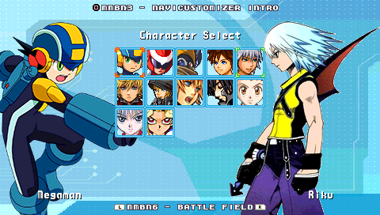
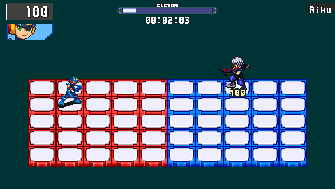
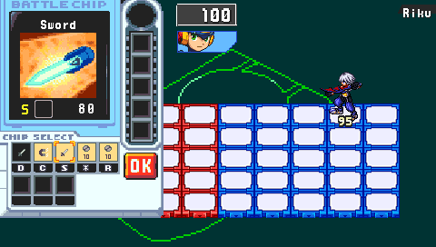
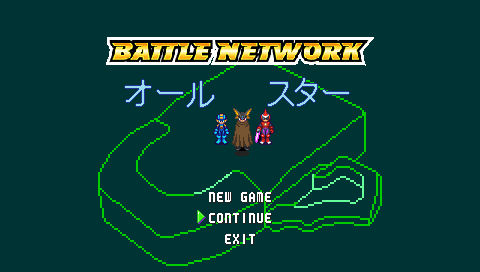

# BattleNetwork-AllStars

This is an old project. It is a PSP (Playstation Portable) game inspired by Megaman: Battle Network game on Game Boy Advance.

This game is a fighting game with characters from various anime / manga / games that I like. The battle system uses the same mechanics than Megaman: Battle Network.

There is a lot that still needs to be implemented.

## What is done

- Title screen
- Character select screen
- Battle screen (HUD, move and basic attack)
- Win & Lose conditions

## What needs to be done

- Load / Save
- Battle Chip system (for now, only UI is done, but you can't select chips yet)
- Story mode (maybe)

## Screenshots

